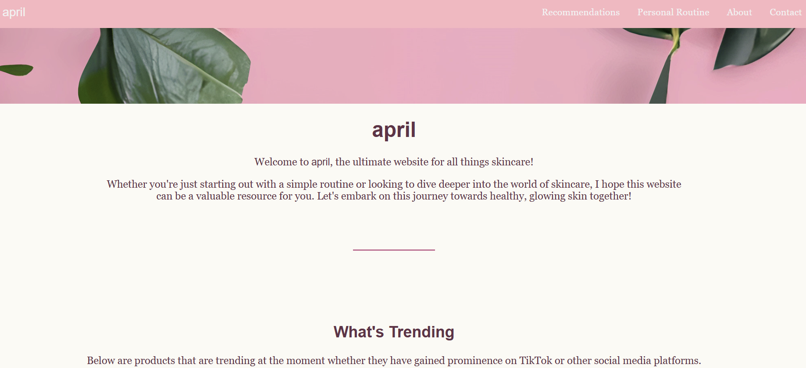
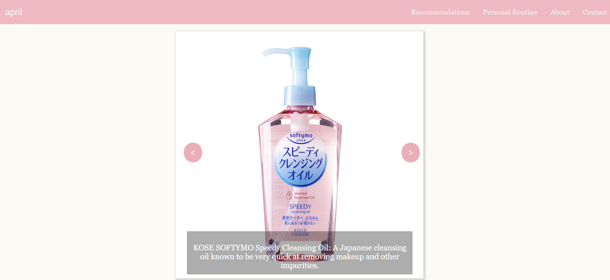
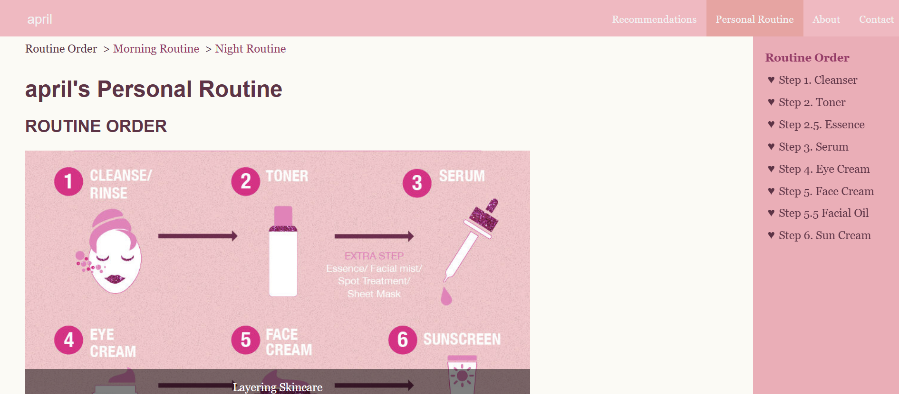

# Skincare Reference Website
A fully responsive, multi-page promotional website focused on skincare routines and education, designed and built as part of a web design project.

## Features
- Clear navigation: Dynamic navigation bar, breadcrumbs, sidebar links, and intuitive structure.
- Interactive elements: Contact form, animated buttons, hover effects, and social media links.
- Responsive design: Media queries for optimized display across devices (desktop, tablet, mobile).
- Rich media use: High-resolution images, slideshows, GIFs, and external links.
- User-centered design: Targeted toward young adults and beginners in skincare, with original and engaging content.
- Fresh, modern aesthetic: Soft color palette (pinks, greens, warm white) to convey a fresh, approachable skincare theme.

## Technologies Used
- HTML5
- CSS3 (including media queries, animations)
- JavaScript basics (for interactivity like slideshows)
- FontAwesome (social media icons)
- AI-enhanced images for better visual quality

## How to View
- Simply open the index.html file in a web browser.
- The site structure includes several linked pages (Home, About, Morning Routine, Night Routine, Recommendations, etc.).

## Credits
- All images and GIFs are credited in the project.
- External assets enhanced with AI tools and free libraries like FontAwesome.
